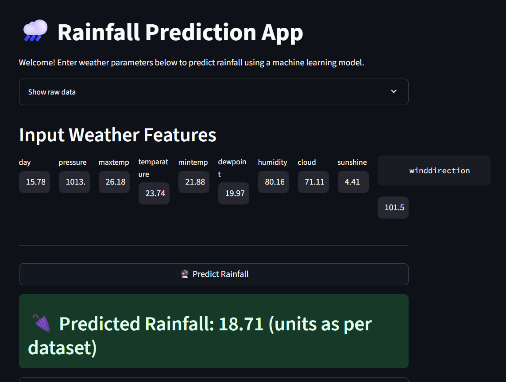

# Rainfall Prediction using Machine Learning

This project demonstrates how to use machine learning techniques to predict rainfall based on historical weather data. The workflow is implemented in a Jupyter Notebook and uses Python libraries such as NumPy, Pandas, Matplotlib, Seaborn, and Scikit-learn.


Below is a screenshot of the Rainfall Prediction Streamlit app:



## Project Structure

- `Rainfall_Prediction_ml.ipynb`: Main Jupyter Notebook containing the code, data analysis, and model building steps.
- `Rainfall.csv`: Dataset containing historical weather and rainfall data.
- `venv/`: (Optional) Python virtual environment directory.
- `.gitignore`: Specifies files and folders to be ignored by Git.

## Features
- Data loading and preprocessing
- Exploratory data analysis and visualization
- Machine learning model training and evaluation
- Rainfall prediction based on input features

## Setup Instructions

1. **Clone the repository**
   ```bash
   git clone https://github.com/Sourabhkumar077/Rainfall-prediction-ml.git
   cd Rainfall-prediction-ml
   ```

2. **Create and activate a virtual environment (optional but recommended)**
   ```bash
   python -m venv venv
   # On Windows:
   .\venv\Scripts\activate
   # On macOS/Linux:
   source venv/bin/activate
   ```

3. **Install required dependencies**
   ```bash
   pip install -r requirements.txt
   # Or, 
   pip install notebook numpy pandas matplotlib seaborn scikit-learn
   ```

4. **Start Jupyter Notebook**
   ```bash
   jupyter notebook
   ```
   Open `Rainfall_Prediction_ml.ipynb` in your browser and run the cells.

## Usage
- Run the notebook cell by cell to follow the data analysis and model building process.
- Modify the code as needed to experiment with different models or datasets.

## Requirements
- Python 3.7+
- Jupyter Notebook
- numpy
- pandas
- matplotlib
- seaborn
- scikit-learn

## Dataset
The dataset (`Rainfall.csv`) should be present in the project directory. It contains historical weather data used for rainfall prediction.

## License
This project is for educational purposes. Please check dataset source for any usage restrictions.

## Acknowledgements
- [Scikit-learn](https://scikit-learn.org/)
- [Pandas](https://pandas.pydata.org/)
- [Matplotlib](https://matplotlib.org/)
- [Seaborn](https://seaborn.pydata.org/) 
<<<<<<< HEAD

Great question! You can create a simple and interactive UI for your rainfall prediction project using **Streamlit**. Streamlit allows you to turn your data science code into a web app with minimal effort.

Here’s how you can proceed:

---

## 1. **Install Streamlit**

Add Streamlit to your environment:
```bash
pip install streamlit
```
(You can also add `streamlit` to your `requirements.txt`.)

---

## 2. **Create a Streamlit App File**

Create a new file, for example: `app.py`

---

## 3. **Basic Streamlit App Structure**

Here’s a template to get you started. This assumes you have a trained model saved (e.g., using `joblib` or `pickle`), or you can load and train the model within the app.

```python
import streamlit as st
import pandas as pd
import numpy as np
# from joblib import load  # Uncomment if you have a saved model

st.title("Rainfall Prediction App")

st.write("""
This app predicts **Rainfall** using a Machine Learning model trained on historical weather data.
""")

# Example input fields (customize based on your dataset features)
temperature = st.number_input("Temperature (°C)", min_value=-10.0, max_value=50.0, value=25.0)
humidity = st.number_input("Humidity (%)", min_value=0.0, max_value=100.0, value=60.0)
wind_speed = st.number_input("Wind Speed (km/h)", min_value=0.0, max_value=100.0, value=10.0)

# Add more input fields as per your model's requirements

if st.button("Predict Rainfall"):
    # Prepare input for the model
    input_data = np.array([[temperature, humidity, wind_speed]])
    # model = load('your_model.joblib')  # Load your trained model
    # prediction = model.predict(input_data)
    prediction = [0]  # Dummy prediction, replace with actual model prediction
    st.success(f"Predicted Rainfall: {prediction[0]} mm")

---

## 4. **Run the Streamlit App**

In your terminal:
```bash
streamlit run app.py
```
This will open a web browser with your interactive UI.

---

## 5. **Next Steps**
- Integrate your actual model and preprocessing steps.
- Add data visualizations using `st.pyplot()` or `st.line_chart()`.
- Customize the UI for better user experience.

---

